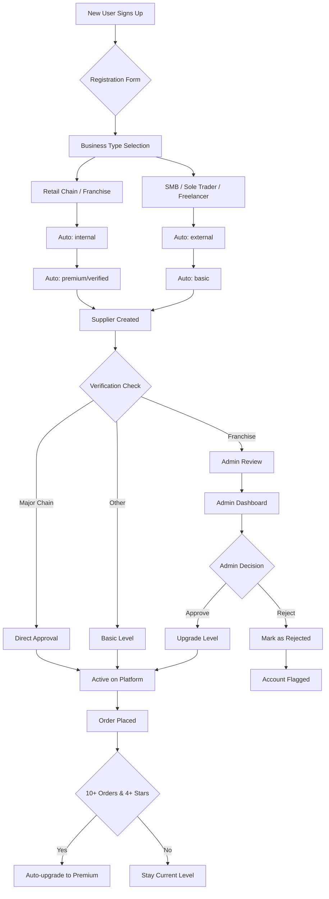

# Hybrid Provider Type Assignment System - Design Document

## Overview

This document outlines a complete hybrid system for automatically assigning `provider_type` (internal/external) and `provider_verification_level` (basic/verified/premium) to new businesses registering on the InstaGoods platform.

---

## 1. Current State Analysis

### Existing Database Schema

The system currently has:

- **suppliers** table with:
  - `id`, `user_id`, `business_name`, `description`, `location`
  - `provider_type` (TEXT, default: 'external')
  - `provider_verification_level` (TEXT, default: 'basic')

- **Existing auto-classification** (in provider-type-schema.sql):
  - Major retail chains → internal + premium
  - Others → external + verified

- **Existing trigger** (handle_new_user):
  - Auto-creates supplier on signup
  - Currently does NOT set provider_type

---

## 2. Auto-Classification Rules Design

### Rule-Based Classification System

The auto-classification will use a **rule priority system** where rules are evaluated in order:

#### Classification Rules

| Priority | Rule Type | Criteria | Provider Type | Verification Level |
|----------|-----------|----------|--------------|-------------------|
| 1 | Exact Match | business_name IN ('Pick n Pay', 'Spar', 'Woolworths', etc.) | internal | premium |
| 2 | Pattern Match | business_name LIKE '%Chain%' OR business_name LIKE '%Retail%' | internal | premium |
| 3 | Business Type | business_type = 'retail_chain' | internal | premium |
| 4 | Business Type | business_type = 'franchise' | internal | verified |
| 5 | Business Type | business_type = 'sole_trader' OR 'freelancer' | external | basic |
| 6 | Default | No match | external | basic |

### Business Type Categories

New suppliers will select a business type during registration:

```
business_type enum:
  - retail_chain    (major retailers - automatic internal)
  - franchise       (franchise businesses - internal)
  - smb             (small/medium business - external)
  - sole_trader     (individual - external)
  - freelancer      (freelance services - external)
```

### Verification Level Rules

| Condition | Level |
|-----------|-------|
| Has verified email + phone | +1 level |
| Has completed profile (description, location, logo) | +1 level |
| Has uploaded business documents | +1 level |
| Has received 10+ orders with 4+ star rating | premium |

---

## 3. Database Trigger Design

### Enhanced handle_new_user Trigger

```sql
CREATE OR REPLACE FUNCTION public.handle_new_user()
RETURNS TRIGGER
LANGUAGE plpgsql
SECURITY DEFINER
SET search_path = public
AS $$
DECLARE
  v_business_name TEXT;
  v_business_type TEXT;
  v_provider_type TEXT := 'external';
  v_verification_level TEXT := 'basic';
BEGIN
  -- Get business info from metadata
  v_business_name := COALESCE(NEW.raw_user_meta_data->>'business_name', '');
  v_business_type := COALESCE(NEW.raw_user_meta_data->>'business_type', 'sole_trader');
  
  -- Auto-classification logic
  SELECT 
    CASE 
      -- Priority 1: Major retail chains
      WHEN v_business_name IN ('Pick n Pay', 'Spar', 'Woolworths', 'DisChem', 'Clicks', 'Checkers', 'Game', 'Makro', 'Build It', 'Power Shop')
        THEN 'internal'
      -- Priority 2: Franchise detection
      WHEN v_business_type = 'franchise'
        THEN 'internal'
      -- Default to external
      ELSE 'external'
    END,
    CASE
      WHEN v_business_name IN ('Pick n Pay', 'Spar', 'Woolworths', 'DisChem', 'Clicks', 'Checkers', 'Game', 'Makro')
        THEN 'premium'
      WHEN v_business_type IN ('retail_chain', 'franchise')
        THEN 'verified'
      ELSE 'basic'
    END
  INTO v_provider_type, v_verification_level;

  -- Insert into profiles
  INSERT INTO public.profiles (id, email, full_name)
  VALUES (
    NEW.id,
    NEW.email,
    COALESCE(NEW.raw_user_meta_data->>'full_name', '')
  );

  -- Insert into suppliers with auto-classification
  INSERT INTO public.suppliers (
    user_id, 
    business_name, 
    description, 
    location,
    provider_type,
    provider_verification_level,
    business_type
  )
  VALUES (
    NEW.id,
    COALESCE(NEW.raw_user_meta_data->>'full_name', 'My Business') || '''s Business',
    'Welcome to InstaGoods! Please update your business information.',
    '',
    v_provider_type,
    v_verification_level,
    v_business_type
  );

  -- Insert into user_roles
  INSERT INTO public.user_roles (user_id, role)
  VALUES (NEW.id, 'supplier');

  RETURN NEW;
END;
$$;
```

### Verification Level Update Trigger

```sql
-- Trigger to auto-update verification level based on supplier actions
CREATE OR REPLACE FUNCTION public.update_verification_level()
RETURNS TRIGGER
LANGUAGE plpgsql
AS $$
DECLARE
  v_order_count INTEGER;
  v_avg_rating NUMERIC;
BEGIN
  -- Get supplier metrics
  SELECT 
    COUNT(*),
    COALESCE(AVG(pr.rating), 0)
  INTO v_order_count, v_avg_rating
  FROM orders o
  LEFT JOIN product_reviews pr ON pr.supplier_id = NEW.id
  WHERE o.supplier_id = NEW.id;

  -- Auto-upgrade to premium
  IF v_order_count >= 10 AND v_avg_rating >= 4.0 AND NEW.provider_verification_level != 'premium' THEN
    NEW.provider_verification_level := 'premium';
  END IF;

  RETURN NEW;
END;
$$;

CREATE TRIGGER update_supplier_verification
  BEFORE UPDATE ON public.suppliers
  FOR EACH ROW
  EXECUTE FUNCTION public.update_verification_level();
```

---

## 4. Backend API Design

### Registration Flow

```
┌─────────────┐     ┌──────────────┐     ┌─────────────────┐     ┌──────────────┐
│  Client     │────▶│  Auth API    │────▶│  Supabase       │────▶│  Trigger     │
│ (Register)  │     │  (signup)    │     │  (handle_new)   │     │  (classify)  │
└─────────────┘     └──────────────┘     └─────────────────┘     └──────────────┘
                                                                    │
                                                                    ▼
                                                           ┌──────────────┐
                                                           │ Admin Queue  │
                                                           │ (if needed)  │
                                                           └──────────────┘
```

### API Endpoints Needed

| Endpoint | Method | Description |
|----------|--------|-------------|
| `/suppliers/me` | GET | Get current supplier profile with provider_type |
| `/suppliers/me` | PATCH | Update supplier info (triggers re-classification) |
| `/admin/suppliers` | GET | List all suppliers (admin only) |
| `/admin/suppliers/:id/type` | PATCH | Override provider_type (admin) |
| `/admin/suppliers/pending` | GET | List suppliers needing review |
| `/admin/suppliers/:id/approve` | POST | Approve/reject supplier (admin) |

### Client-Side Registration Form

The registration form should collect:

```typescript
interface RegistrationData {
  email: string;
  password: string;
  full_name: string;
  business_name: string;
  business_type: 'retail_chain' | 'franchise' | 'smb' | 'sole_trader' | 'freelancer';
  location?: string;
  description?: string;
}
```

---

## 5. Admin Dashboard Design

### Supplier Management Page

The admin dashboard should include:

#### Features
1. **Supplier List View**
   - Filter by provider_type (internal/external)
   - Filter by verification_level (basic/verified/premium)
   - Filter by review_status (pending/approved/rejected)
   - Search by business name

2. **Supplier Detail View**
   - View full supplier profile
   - View order history and ratings
   - Override provider_type dropdown
   - Override verification_level dropdown
   - Add admin notes

3. **Pending Reviews Queue**
   - List suppliers flagged for manual review
   - Quick approve/reject buttons
   - Bulk actions

### Database Views for Admin

```sql
-- View for admin supplier management
CREATE OR REPLACE VIEW supplier_admin_view AS
SELECT 
  s.id,
  s.business_name,
  s.description,
  s.location,
  s.provider_type,
  s.provider_verification_level,
  s.business_type,
  s.is_active,
  s.created_at,
  COUNT(DISTINCT o.id) as total_orders,
  COALESCE(AVG(pr.rating), 0) as avg_rating,
  COUNT(DISTINCT pr.id) as total_reviews,
  CASE 
    WHEN s.provider_type IS NULL THEN 'pending_review'
    WHEN s.provider_type = 'internal' AND s.provider_verification_level = 'premium' THEN 'approved'
    ELSE 'needs_review'
  END as review_status
FROM suppliers s
LEFT JOIN orders o ON o.supplier_id = s.id
LEFT JOIN product_reviews pr ON pr.supplier_id = s.id
GROUP BY s.id;

-- RLS policy for admins only
CREATE POLICY "Admins can view supplier admin view"
  ON supplier_admin_view FOR SELECT
  USING (public.has_role(auth.uid(), 'admin'));
```

---

## 6. System Architecture

### Complete Flow Diagram



### Component Responsibilities

| Component | Responsibility |
|-----------|---------------|
| **Auth Trigger** | Creates supplier record with initial classification |
| **Classification Logic** | Applies rules to determine provider_type/level |
| **Admin API** | Allows manual overrides of classification |
| **Verification Trigger** | Auto-upgrades based on performance metrics |
| **Admin Dashboard** | UI for reviewing and managing suppliers |

---

## 7. Implementation Recommendations

### Phase 1: Database Changes (Priority: High)

1. Add `business_type` column to suppliers table
2. Update `handle_new_user` trigger with classification logic
3. Create admin views and policies
4. Add verification upgrade trigger

### Phase 2: API Updates (Priority: High)

1. Update signup flow to accept business_type
2. Add admin endpoints for supplier management
3. Add endpoint to update provider_type manually

### Phase 3: Admin Dashboard (Priority: Medium)

1. Create admin supplier management page
2. Add filters for provider_type and verification_level
3. Add override controls
4. Add pending review queue

### Phase 4: Client Updates (Priority: Medium)

1. Update registration form to include business_type
2. Show provider badge on supplier profiles
3. Add verification progress indicator

---

## 8. SQL Scripts Required

### New Tables/Columns

```sql
-- Add business_type column
ALTER TABLE suppliers 
ADD COLUMN IF NOT EXISTS business_type TEXT DEFAULT 'sole_trader'
CHECK (business_type IN ('retail_chain', 'franchise', 'smb', 'sole_trader', 'freelancer'));

-- Add review status
ALTER TABLE suppliers 
ADD COLUMN IF NOT EXISTS review_status TEXT DEFAULT 'pending'
CHECK (review_status IN ('pending', 'approved', 'rejected'));

-- Add admin notes
ALTER TABLE suppliers 
ADD COLUMN IF NOT EXISTS admin_notes TEXT;
```

### Updated Trigger

See Section 3 for complete trigger code.

### Admin Views

See Section 5 for view definitions.

---

## 9. Summary

This hybrid system provides:

1. **Automatic classification** based on business type during registration
2. **Default assignments** using database triggers
3. **Manual overrides** via admin dashboard
4. **Auto-upgrades** based on performance metrics
5. **Audit trail** with admin notes and review status

The system is flexible and can be adjusted by modifying the classification rules in the trigger or adding new rules as the business grows.
